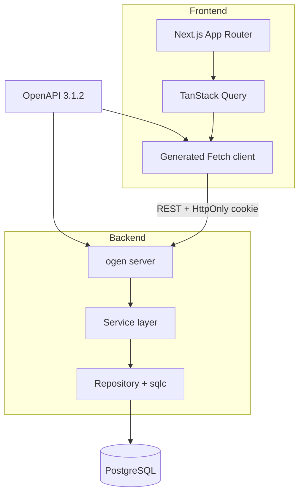
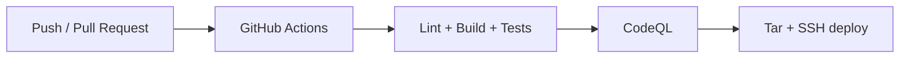

# Comunicore

> **Статус:** проект находится в активной разработке. Ниже отдельно указаны уже реализованные возможности и запланированные функции.

**Comunicore** — fullstack-платформа форума/сообществ с аналитикой поведения пользователей. Это монорепозиторий с тремя основными зонами: `frontend/`, `backend/`, `config/`. Ниже — разбор технологий, подходов и архитектуры.

[Comunicore](http://comunicore.mooo.com) · [Связаться в Telegram](https://t.me/Mohatma)


---

## Возможности

### Реализовано

- регистрация, вход, выход и серверные пользовательские сессии;
- управление пользователями и профилями;
- темы форума, публикации и теги;
- Markdown-контент с подсветкой синтаксиса и санитизацией HTML;
- загрузка медиафайлов с дедупликацией по SHA-256;
- batch-сбор метрик посещений и активности пользователей;
- единый типобезопасный API-контракт для frontend и backend;
- интеграционные и E2E-тесты API с изолированной PostgreSQL;
- автоматизированные проверки, сборка и production-деплой.
---

## Архитектура



Проект представляет собой модульный монолит в монорепозитории с тремя основными зонами:

```text
comunicore/
├── frontend/                 # Next.js-приложение
├── backend/                  # Go API и бизнес-логика
└── config/                   # OpenAPI, dev- и deploy-конфигурация
```

### Contract-First API

Единый источник правды — спецификация **OpenAPI 3.1.2**:

```text
config/comunicore-api.yaml
```

Из неё автоматически генерируются:

| Сторона | Инструмент | Результат |
| --- | --- | --- |
| Backend | `ogen` | HTTP-сервер, роутинг, модели, валидация и security handlers |
| Frontend | `@hey-api/openapi-ts` | Fetch-клиент, TypeScript-типы и интеграция с TanStack Query |

Изменения сетевого контракта начинаются с OpenAPI-спецификации. Сгенерированный код не редактируется вручную.

---

## Технологический стек

### Frontend

Frontend построен по методологии **Feature-Sliced Design**:

```text
app → widgets → features → entities → shared
```

Архитектурные границы контролируются с помощью `eslint-plugin-fsd-lint`: импорты между слоями и slices выполняются через public API, а бизнес-логика отделена от UI.

| Категория | Технологии | Назначение |
| --- | --- | --- |
| Core | `Next.js 16.1.x`, `React 19`, `TypeScript 5` | App Router, компонентный UI и строгая типизация |
| Сборка | Static Export (`output: 'export'`) | Статическая сборка в `frontend/out/` |
| Server state | `TanStack Query v5` | Запросы, кэширование и синхронизация данных сервера |
| Client state | `Zustand`, `Immer` | Состояние сессии и локальный client state |
| API | `@hey-api/openapi-ts`, Fetch API | Сгенерированный типобезопасный клиент без Axios |
| Формы | `react-hook-form`, `Zod v4` | Управление формами и UI-валидация пользовательского ввода |
| Стили | `Tailwind CSS v4`, `PostCSS` | Утилитарная стилизация и кастомная тема |
| Контент | `markdown-it`, `highlight.js`, `isomorphic-dompurify` | Markdown, подсветка кода и защита от XSS |
| Mock API | `MSW 2.x` | Изолированная frontend-разработка |
| Качество | `ESLint 9`, `Prettier`, `Stylelint`, `Husky` | Статические проверки и pre-commit hooks |

> Zod используется для правил конкретных форм. Типы сетевых запросов и ответов поступают из OpenAPI и не описываются вручную второй раз.

### Backend

Backend построен на стандартной библиотеке Go без Gin, Echo или Fiber. Внутри используется layered-архитектура:

```text
HTTP → Handler → Service → Repository → PostgreSQL
```

| Категория | Технологии | Назначение |
| --- | --- | --- |
| Core | `Go 1.26`, `net/http` | HTTP-сервер и управление жизненным циклом приложения |
| API | `ogen` | Генерация сервера, моделей, валидации и security handlers |
| База данных | `PostgreSQL 18`, `pgx/v5`, `sqlc` | Типобезопасные SQL-запросы и пул соединений |
| Миграции | `golang-migrate` | Миграции через отдельное Go-приложение с общим TOML-конфигом |
| Конфигурация | TOML, CLI flags, environment variables | Приоритет настроек: CLI → env → TOML |
| Безопасность | `Argon2id`, HttpOnly cookie | Хеширование паролей и серверные UUID-сессии без JWT |
| Медиа | SHA-256 file storage | Дедупликация загружаемых файлов |
| Автоматизация | `just` | Сборка, тестирование, линтинг и кодогенерация |
| Тестирование | `testcontainers-go`, `httpexpect`, `testify` | Интеграционные и E2E-тесты API |

Основные backend-слои:

```text
backend/
├── cmd/
│   ├── comunicore/           # точка входа API
│   └── migrate/              # запуск миграций
└── internal/
    ├── handler/              # HTTP-адаптеры и ogen handlers
    ├── service/              # бизнес-логика
    ├── repository/           # sqlc queries и pgx
    ├── apperror/             # типизированные доменные ошибки
    ├── lib/                  # конфигурация и общие утилиты
    └── tests/e2e/            # E2E-тесты API
```

---

## Локальная разработка

### Требования

- Node.js 22;
- Go 1.26;
- PostgreSQL 18;
- Docker — для dev-окружения и testcontainers;
- `just`;
- `sqlc`.

### 1. Настройте backend

Backend читает настройки из TOML-файла, environment variables и CLI-флагов:

```text
CLI flags > environment variables > TOML file
```

Доступные параметры:

```bash
cd backend
go run ./cmd/comunicore --help
```

Перед запуском настройте подключение к PostgreSQL, адрес HTTP-сервера, разрешённый CORS origin, cookie и хранилище медиафайлов.

### 2. Примените миграции и запустите API

```bash
cd backend
go mod download
go run ./cmd/migrate
go run ./cmd/comunicore
```

Доступные задачи автоматизации можно посмотреть командой:

```bash
just --list
```

### 3. Запустите frontend

```bash
cd frontend
npm ci
npm run dev
```

### 4. Соберите production-версию frontend

```bash
cd frontend
npm run build
```

Результат static export будет сохранён в `frontend/out/`.

---

## Кодогенерация

При изменении `config/comunicore-api.yaml` необходимо:

1. проверить OpenAPI-схему;
2. перегенерировать ogen-код backend;
3. перегенерировать frontend API-клиент;
4. запустить форматирование, typecheck и тесты;
5. добавить изменения контракта и сгенерированного кода в один Pull Request.

После изменения SQL-запросов или схемы базы данных перегенерируйте sqlc-код:

```bash
cd backend
sqlc generate
```

Точные команды проекта перечислены в `backend/justfile` и `frontend/package.json`.

---

## Тестирование

### Backend

```bash
cd backend
go test ./...
```

E2E-тесты находятся в `backend/internal/tests/e2e/`. Во время запуска testcontainers поднимает изолированный экземпляр PostgreSQL, а `httpexpect` проверяет HTTP API. Для этих тестов должен быть доступен Docker daemon.

### Frontend

```bash
cd frontend
npm run lint
npm run build
```

В dev-режиме MSW позволяет разрабатывать интерфейс независимо от доступности backend. Перед commit Husky и lint-staged запускают проверки изменённых файлов.

---

## CI/CD и production



GitHub Actions использует Node.js 22 и Go 1.26, собирает обе части приложения, запускает проверки и анализирует код с помощью CodeQL.

Production работает на **Ubuntu 26.04 LTS** без Docker:

- Nginx раздаёт статический frontend из `frontend/out/`;
- запросы `/api/*` проксируются на Go API;
- systemd управляет backend-процессом;
- миграции выполняются перед запуском новой версии;
- backend обрабатывает `SIGINT` и `SIGTERM` и корректно завершает работу с таймаутом 10 секунд.

Go-бинарник собирается в CI, поэтому на production-сервере не требуется установленный Go toolchain.

---

## Данные

Основные реализованные сущности:

- `users`, `auth_passwords`, `sessions` — пользователи и авторизация;
- `threads`, `posts`, `thread_tags` — форумный контент;
- `analytics_visit_batches` — агрегированные метрики посещений.

В рамках развития сообществ планируется добавить отдельные сущности для приватности, правил и ролевой модели участников. Для эффективного чтения глубоко вложенных комментариев рассматриваются рекурсивные SQL-запросы на основе `WITH RECURSIVE`.
